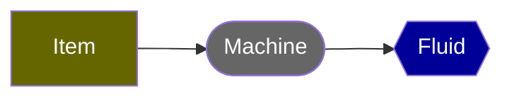

# css styling for mermaid docs

```mermaid
flowchart LR
it[Item]
fl{{Fluid}}
ma([Machine])

it --> ma --> fl

classDef item fill:#660,color:white;
classDef fluid fill:#009,color:white;
classDef machine fill:#666,color:white;

class it item
class fl fluid
class ma machine
```
