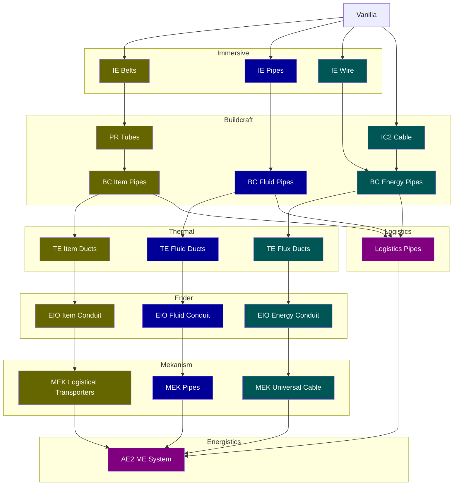

# Logistics

```mermaid
flowchart TD
classDef automation fill:purple,color:white
classDef item fill:#660,color:white;
classDef fluid fill:#009,color:white;
classDef energy fill:#055,color:white;

van[Vanilla]
subgraph Immersive
iebelt[IE Belts]:::item
iepipe[IE Pipes]:::fluid
iewire[IE Wire]:::energy
end
subgraph Buildcraft
ic2cable[IC2 Cable]:::energy
prtube[PR Tubes]:::item
bcipipe[BC Item Pipes]:::item
bcfpipe[BC Fluid Pipes]:::fluid
bcepipe[BC Energy Pipes]:::energy
end
subgraph Logistics
lp[Logistics Pipes]:::automation
end
subgraph Thermal
teiduct[TE Item Ducts]:::item
tefduct[TE Fluid Ducts]:::fluid
teeduct[TE Flux Ducts]:::energy
end
subgraph Ender
eioiconduit[EIO Item Conduit]:::item
eiofconduit[EIO Fluid Conduit]:::fluid
eioeconduit[EIO Energy Conduit]:::energy
end
subgraph Mekanism
mekitrans[MEK Logistical Transporters]:::item
mekftrans[MEK Pipes]:::fluid
meketrans[MEK Universal Cable]:::energy
end
subgraph Energistics
ae2[AE2 ME System]:::automation
end

van --> iebelt
van --> iepipe
van --> iewire & ic2cable

iebelt --> prtube
prtube --> bcipipe
bcipipe --> teiduct
teiduct --> eioiconduit
eioiconduit --> mekitrans
mekitrans --> ae2

iepipe --> bcfpipe
bcfpipe --> tefduct
tefduct --> eiofconduit
eiofconduit --> mekftrans
mekftrans --> ae2

iewire & ic2cable --> bcepipe
bcepipe --> teeduct
teeduct --> eioeconduit
eioeconduit --> meketrans
meketrans --> ae2

bcfpipe --> lp
bcepipe --> lp
bcipipe --> lp
lp --> ae2
```
