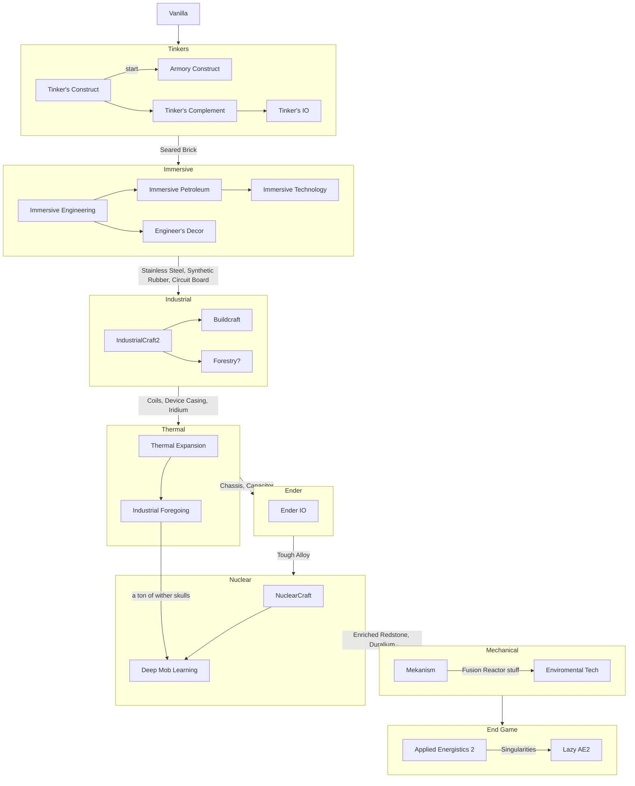

# Mod Progression

```mermaid
flowchart TB
VAN[Vanilla]
subgraph TICS [Tinkers]
direction LR
TC[Tinker's Construct]
AC[Armory Construct]
TIO[Tinker's IO]
TCM[Tinker's Complement]
end
subgraph IMMR [Immersive]
direction LR
IE[Immersive Engineering]
IP[Immersive Petroleum]
IT[Immersive Technology]
ED[Engineer's Decor]
end
subgraph INDS [Industrial]
direction LR
IC2[IndustrialCraft2]
BC[Buildcraft]
FOR[Forestry?]
end
subgraph COFH [Thermal]
direction LR
TE[Thermal Expansion]
IF[Industrial Foregoing]
end
subgraph ENDR [Ender]
direction LR
EIO[Ender IO]
end
subgraph NUCC [Nuclear]
direction LR
NUC[NuclearCraft]
DML[Deep Mob Learning]
end
subgraph MECH [Mechanical]
direction LR
MEK[Mekanism]
ENV[Enviromental Tech]
end
subgraph END [End Game]
direction LR
AE2[Applied Energistics 2]
LAE[Lazy AE2]
end

VAN --> TICS
TICS -- Seared Brick --> IMMR
TC -- start --> AC
IE --> IP --> IT
IE --> ED
IMMR -- Stainless Steel, Synthetic Rubber, Circuit Board --> INDS
INDS -- Coils, Device Casing, Iridium --> COFH
COFH -- Chassis, Capacitor --> ENDR
ENDR -- Tough Alloy --> NUCC
NUCC -- Enriched Redstone, Duralium --> MECH
MECH --> END

%% sidegrades
TC --> TCM
TCM --> TIO
IC2 --> BC & FOR
TE --> IF
MEK -- Fusion Reactor stuff--> ENV
IF -- a ton of wither skulls --> DML
NUC --> DML
AE2 --Singularities-->LAE
```
