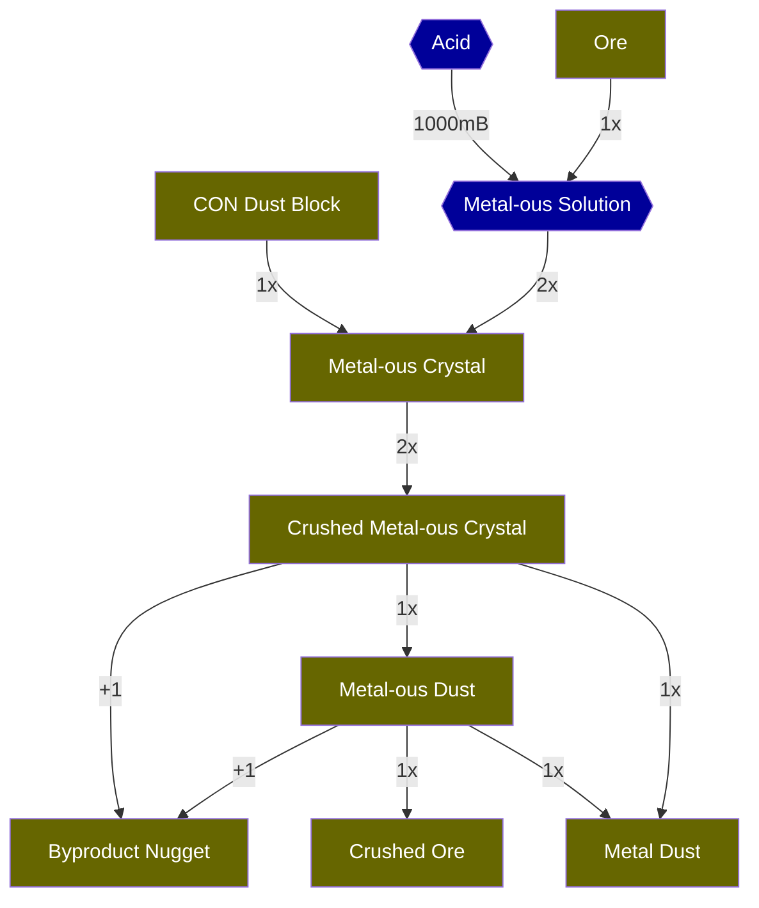

# Ore Processing

ore processing for rare byproducts (iridium, mana dust)

based on `Feed the Factory` and `Brass` ore processing

## Philosophy

Each major ore (iron, gold, copper, tin, aluminum, lead, silver, nickel, osmium)
can be combined with some liquid chemical for ore processing for byproducts.

These byproducts are used for late-mod materials.

Each ore(/set of ores?) has a chemical it can be mixed with.

The byproduct-focused chain starts with ore and a chemical, and ends with IC2/JAOPA Crushed Ore.

In total, you can get 8 dust + 2 byproduct nuggets + 1 crushed ore per 1 ore.

IC2/JAOPA Crushed Ore can be treated as ore for Mekanism ore processing.

| Ore      | Acid              | Byproduct       |
| -------- | ----------------- | --------------- |
| Iron     | Hydrogen Chloride | ***Iridium***   |
| Gold     | Hydrogen Chloride | Silver          |
| Tin      | Hydrogen Chloride | Iron            |
| Aluminum | Hydrogen Chloride | Iron            |
| Copper   | Nitric Acid       | Tin             |
| Lead     | Nitric Acid       | Silver          |
| Silver   | Nitric Acid       | Lead            |
| Nickel   | Nitric Acid       | Platinum        |
| Osmium   | Nitric Acid       | ***Manganese*** |

## iridium

this is an ic2-level recipe

* iron ore + 1000 hydrogen chloride (f) =(IE Mixer)= 1000 Ferrous Chloride Solution (bright green) + 500 hydrogen
* 1000 Ferrous Chloride Solution =(BC Heater, cooling)= 1000 Cold Ferrous Chloride Solution
* 1000 Cold Ferrous Chloride Solution =(BC Heater, cooling)= 1000 Freezing Ferrous Chloride Solution
* 500 Freezing Ferrous Chloride Solution + Dust =(IC2 canning machine, fluid+item = item)= 1 Ferrous Crystal
* 1 FeCl2 Crystal =(IC2 Macerator)= 2 Crushed Ferrous
* 1 Crushed Ferrous =(IC2 Ore Washer)= 1 Ferrous Dust + 1 iridium shard + 1 Iron Dust
* 1 Ferrous Dust =(IC2 Thermal Centrifuge)= 1 Iron Dust + 1 iridium shard + 1 Crushed Iron Ore

### Totals

* 1x ore
* = 2 crystal
* = 4 crushed
* = 4 Fe Dust
* = 8 iron dust + 2 iridium shard + 1 crushed iron

<!---

-->
