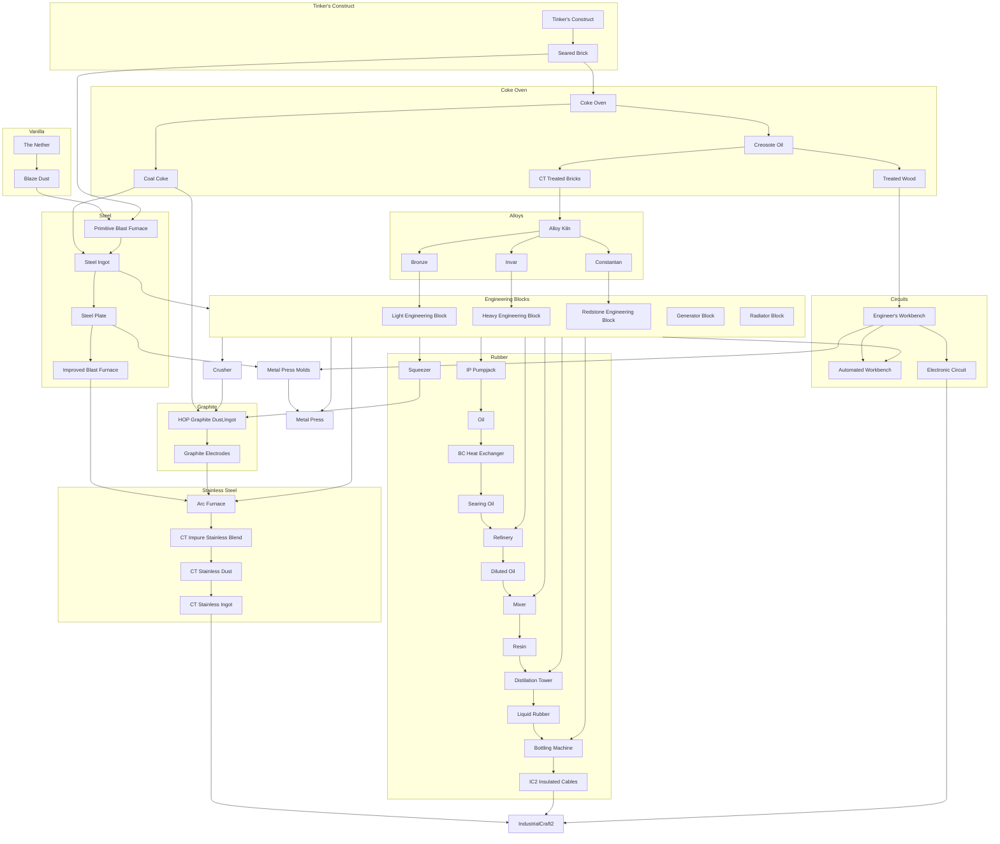

# Quests: Immersive Engineering/Petrol/Decor/Doors/Tech

```mermaid
flowchart TD
subgraph Tinker's Construct
tic[Tinker's Construct]
seared[Seared Brick]
end
press[Metal Press]
crusher[Crusher]
subgraph Circuits
engi_table[Engineer's Workbench]
auto_table[Automated Workbench]
circuit[Electronic Circuit]
end
subgraph Coke Oven
oven[Coke Oven]
coke[Coal Coke]
creo[Creosote Oil]
treat[Treated Wood]
brick[CT Treated Bricks]
end
subgraph Alloys
kiln[Alloy Kiln]
bronze[Bronze]
invar[Invar]
const[Constantan]
end
subgraph engin [Engineering Blocks]
light[Light Engineering Block]
heavy[Heavy Engineering Block]
redst[Redstone Engineering Block]
gener[Generator Block]
radia[Radiator Block]
end
subgraph Steel
pri_blast[Primitive Blast Furnace]
imp_blast[Improved Blast Furnace]
steel[Steel Ingot]
plate[Steel Plate]
end
subgraph Graphite
hop[HOP Graphite Dust,Ingot]
electrode[Graphite Electrodes]
end
subgraph Stainless Steel
staini[CT Stainless Ingot]
staind[CT Stainless Dust]
stainb[CT Impure Stainless Blend]
arc[Arc Furnace]
end
molds[Metal Press Molds]
subgraph Vanilla
nether[The Nether]
blaze[Blaze Dust]
end
ic2[IndustrialCraft2]

subgraph Rubber
mixer[Mixer]
refinery[Refinery]
distiller[Distilation Tower]
pumpjack[IP Pumpjack]
heater[BC Heat Exchanger]
squeezer[Squeezer]
bottler[Bottling Machine]

oil[Oil]
searoil[Searing Oil]
diloil[Diluted Oil]
resin[Resin]
rubber[Liquid Rubber]
cables[IC2 Insulated Cables]
end

tic --> seared --> oven
oven --> coke & creo
creo --> treat & brick
engi_table --> molds
treat --> engi_table --> auto_table
engi_table --> circuit
brick --> kiln --> bronze & invar & const
bronze --> light
invar --> heavy
const --> redst
nether --> blaze
blaze & seared --> pri_blast
coke & pri_blast --> steel
steel --> engin
steel --> plate
plate --> imp_blast --> arc
plate --> molds --> press
engin --> press & auto_table & arc & mixer & refinery & distiller & squeezer & crusher & pumpjack & bottler
coke & squeezer & crusher --> hop --> electrode --> arc
arc --> stainb --> staind -->  staini
staini --> ic2

pumpjack --> oil
oil --> heater --> searoil
searoil --> refinery --> diloil
diloil --> mixer --> resin
resin --> distiller --> rubber
rubber --> bottler --> cables
cables & circuit --> ic2
```
