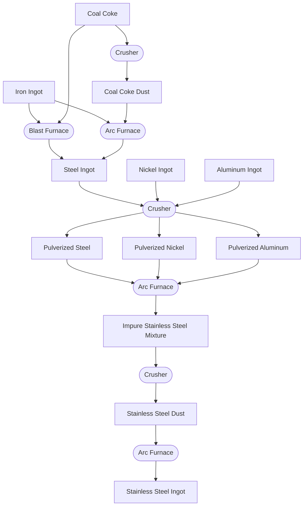

# Stainless Steel

```mermaid
graph TD;
ssi[Stainless Steel Ingot]
ssd[Stainless Steel Dust]
issm[Impure Stainless Steel Mixture]
ps[Pulverized Steel]
pn[Pulverized Nickel]
pa[Pulverized Aluminum]
si[Steel Ingot]
ii[Iron Ingot]
ni[Nickel Ingot]
ai[Aluminum Ingot]

AF1([Arc Furnace])
CR1([Crusher])
AF2([Arc Furnace])
CR2([Crusher])
BF([Blast Furnace])
AF3([Arc Furnace])
CR3([Crusher])


ssd --> AF1 --> ssi
issm --> CR1 --> ssd
ps & pn & pa --> AF2 --> issm
si --> CR2 --> ps
ni --> CR2 --> pn
ai --> CR2 --> pa
ii --> BF & AF3 --> si
ccd[Coal Coke Dust] --> AF3
cc[Coal Coke] --> BF & CR3
CR3 --> ccd
```
