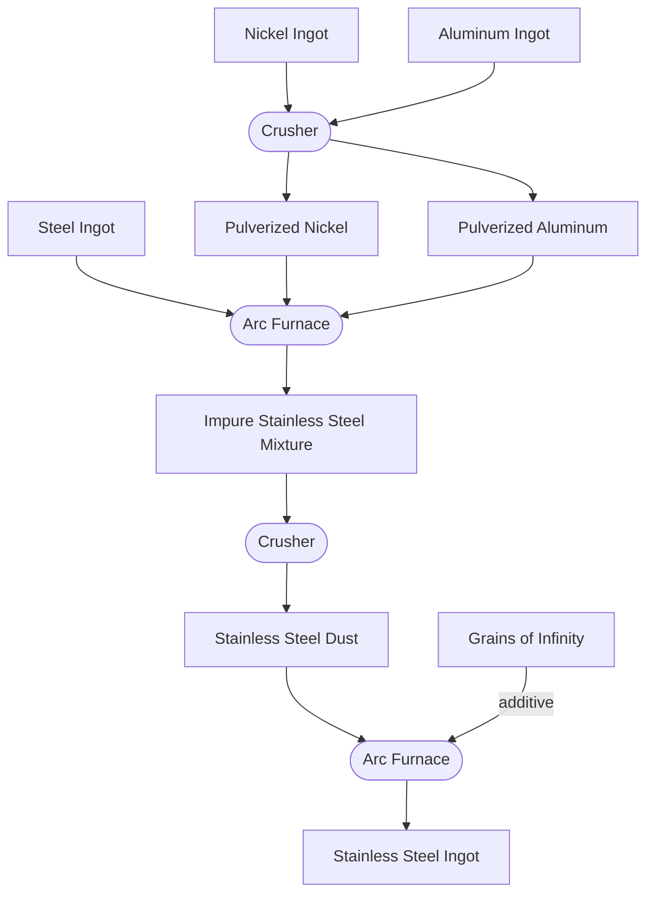

# Stainless Steel

```mermaid
graph TD;
ssi[Stainless Steel Ingot]
ssd[Stainless Steel Dust]
issm[Impure Stainless Steel Mixture]
pn[Pulverized Nickel]
pa[Pulverized Aluminum]
si[Steel Ingot]
ni[Nickel Ingot]
ai[Aluminum Ingot]
gin[Grains of Infinity]

AF1([Arc Furnace])
CR1([Crusher])
AF2([Arc Furnace])
CR2([Crusher])


ssd --> AF1 --> ssi
gin --additive--> AF1
issm --> CR1 --> ssd
si & pn & pa --> AF2 --> issm
ni --> CR2 --> pn
ai --> CR2 --> pa
```
