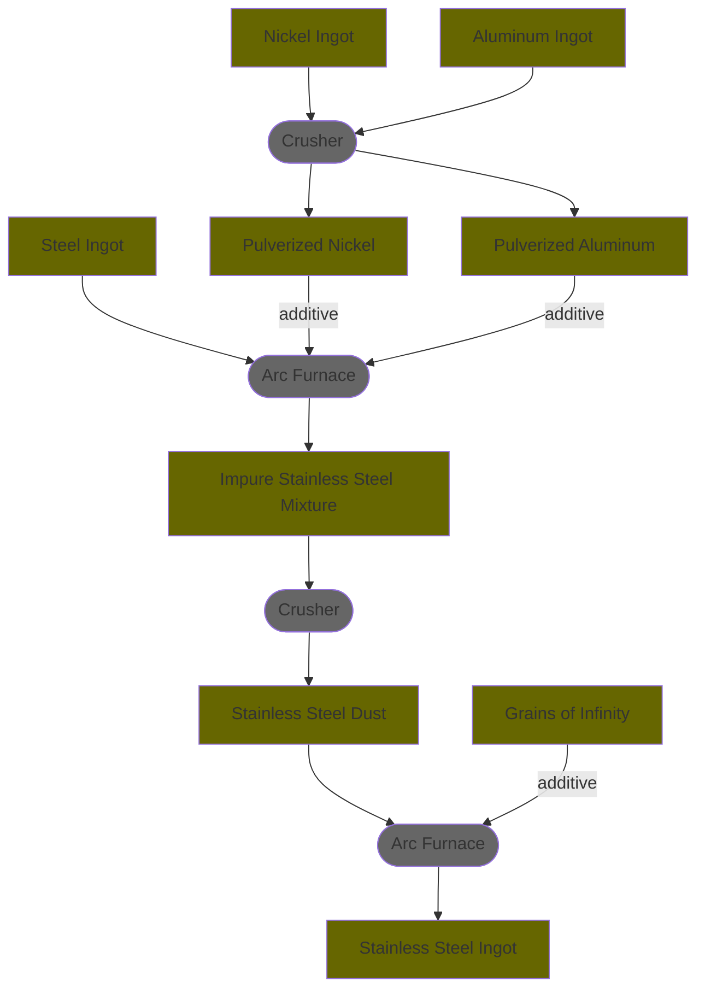

# Stainless Steel

```mermaid
graph TD;

classDef item fill:#660;
classDef fluid fill:#009;
classDef machine fill:#666;

ssi[Stainless Steel Ingot]:::item
ssd[Stainless Steel Dust]:::item
issm[Impure Stainless Steel Mixture]:::item
pn[Pulverized Nickel]:::item
pa[Pulverized Aluminum]:::item
si[Steel Ingot]:::item
ni[Nickel Ingot]:::item
ai[Aluminum Ingot]:::item
gin[Grains of Infinity]:::item

AF1([Arc Furnace]):::machine
CR1([Crusher]):::machine
AF2([Arc Furnace]):::machine
CR2([Crusher]):::machine


ssd --> AF1 --> ssi
gin --additive--> AF1
issm --> CR1 --> ssd
si --> AF2 --> issm
pn & pa  --additive--> AF2
ni --> CR2 --> pn
ai --> CR2 --> pa
```
