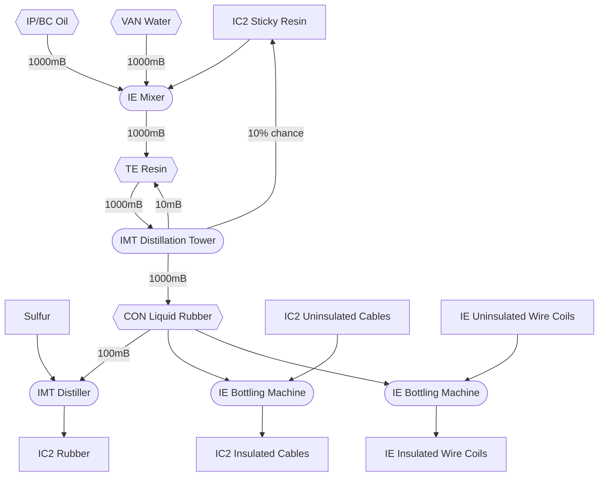

# Synthetic Rubber

(not from trees, but from oil)

```mermaid
graph TD;

sr[IC2 Sticky Resin]
rb[IC2 Rubber]
sf[Sulfur]

oil{{IP/BC Oil}}
wat{{VAN Water}}
res{{TE Resin}}
lrb{{CON Liquid Rubber}}

DS1([IMT Distillation Tower])
DIST([IMT Distiller])
MIX([IE Mixer])

oil & wat --1000mB--> MIX --1000mB--> res
sr --> MIX
res --1000mB--> DS1 --1000mB--> lrb
DS1 --10mB--> res
DS1 --10% chance--> sr
sf --> DIST
lrb --100mB--> DIST --> rb


BOT1([IE Bottling Machine])
BOT2([IE Bottling Machine])
cable[IC2 Uninsulated Cables]
insCable[IC2 Insulated Cables]
wire[IE Uninsulated Wire Coils]
insWire[IE Insulated Wire Coils]

cable --> BOT1 --> insCable
wire --> BOT2 --> insWire
lrb --> BOT1 & BOT2

```
