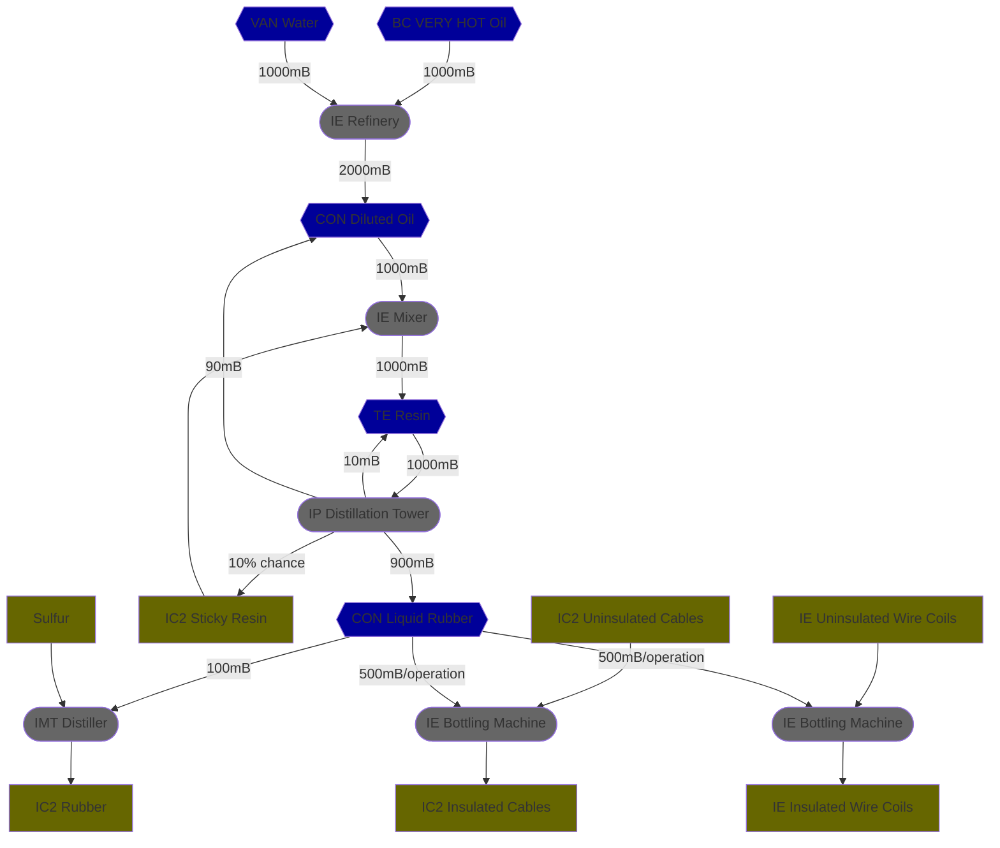

# Synthetic Rubber

not from trees (ish), but from oil

```mermaid
flowchart TD

classDef item fill:#660;
classDef fluid fill:#009;
classDef machine fill:#666;

wat{{VAN Water}}:::fluid
oil{{BC VERY HOT Oil}}:::fluid
REF([IE Refinery]):::machine
diloil{{CON Diluted Oil}}:::fluid

DS1([IP Distillation Tower]):::machine
MIX([IE Mixer]):::machine
res{{TE Resin}}:::fluid

lrb{{CON Liquid Rubber}}:::fluid
sr[IC2 Sticky Resin]:::item
sf[Sulfur]:::item
DIST([IMT Distiller]):::machine
rb[IC2 Rubber]:::item

BOT1([IE Bottling Machine]):::machine
BOT2([IE Bottling Machine]):::machine
cable[IC2 Uninsulated Cables]:::item
insCable[IC2 Insulated Cables]:::item
wire[IE Uninsulated Wire Coils]:::item
insWire[IE Insulated Wire Coils]:::item

diloil --1000mB--> MIX --1000mB--> res
oil & wat --1000mB--> REF --2000mB--> diloil
sr --> MIX
res --1000mB--> DS1
DS1 --10mB--> res
DS1 --90mB--> diloil
DS1 --900mB--> lrb
DS1 --10% chance--> sr
lrb --100mB--> DIST --> rb
sf --> DIST

cable --> BOT1 --> insCable
wire --> BOT2 --> insWire
lrb --500mB/operation--> BOT1 & BOT2
```
